# ClarityRx 🧠📄  
### Django-Based AI Document Processing System (College Project)

ClarityRx is a **college project** built using **Django** that demonstrates **backend-driven integration of third-party AI services**. The application allows users to upload documents or images, extract text using an **OCR service**, and translate the extracted text using an **LLM-based translation API** (Groq LLaMA 8B).

The primary goal of this project is **learning and practical exposure** to backend development, API integration, and real-world deployment constraints.

---

## 🎯 Project Objectives

- Understand Django backend architecture
- Learn third-party API integration
- Explore OCR and LLM-based translation workflows
- Gain experience with cloud deployment
- Identify real-world limitations of free-tier infrastructure

---

## 🚀 Features

- User authentication (login & signup)
- Image/document upload functionality
- Text extraction via third-party OCR API
- Multilingual translation using LLM (Groq API)
- Modular Django app structure
- Environment-based configuration using `.env`
- Deployed on Render (free tier)

---

## 🏗️ Application Workflow

1. User signs up or logs in
2. User uploads an image or document
3. Django backend processes the request
4. OCR service extracts text from the document
5. Extracted text is translated using the LLM API
6. Output is returned to the user

This workflow is designed to be **simple and easy to understand**, keeping learning as the primary focus.

---

## 🛠️ Tech Stack

- **Backend Framework:** Django (Python)
- **Authentication:** Django built-in authentication system
- **AI Services:**
  - Third-party OCR API (OCR.Space)
  - Groq llama-3.1-8b-instant (LLM-based translation)
- **Frontend:** HTML / CSS (basic UI)
- **Configuration:** Environment variables (`.env`)
- **Deployment:** Render (free tier)

---

## 📂 Project Structure
```
ClarityRx/
│── authentication/ # Login & signup logic
│── core/ # OCR & translation integration
│── config/ # Django settings
│── templates/ # HTML templates
│── static/ # Static files
│── manage.py
```
---

## 🔐 Authentication Note

The project includes a **login and signup system** using Django’s authentication framework.

Due to the use of **Render’s free-tier database and cold-start behavior**, authentication may sometimes feel slow or unreliable after periods of inactivity. This issue is related to **deployment limitations**, not the authentication logic itself.

---

## 📌 Deployment Limitations

This project is deployed on a **free cloud tier for academic purposes**.  
Because of this, the following limitations may be observed:

- Cold starts after inactivity
- Delays during login/signup
- Limited database performance

These limitations are expected in free-tier environments and were part of the learning experience.

---

## 🧪 Use Cases

- Learning OCR-based document processing
- Exploring LLM-powered translation
- Understanding backend request handling
- Gaining hands-on experience with Django deployment

---

## 🖼️ Screenshots

<table>
  <tr>
    <td align="center"><b>Desktop</b></td>
    <td align="center"><b>Mobile</b></td>
  </tr>
  <tr>
    <td>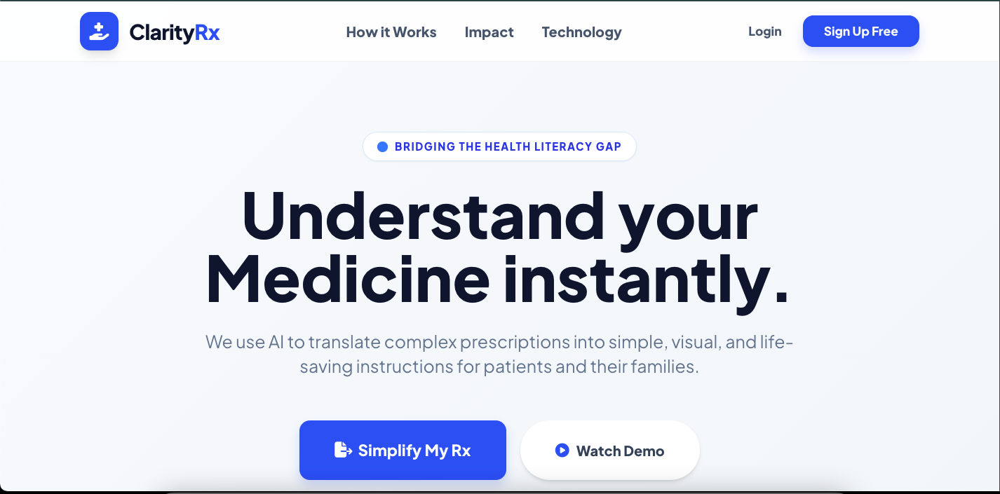</td>
    <td></td>
  </tr>
  <tr>
    <td>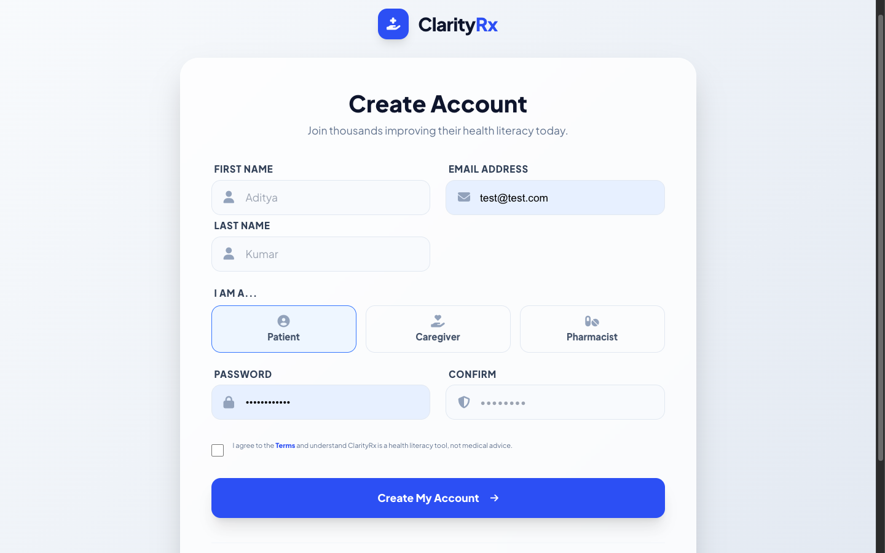</td>
    <td>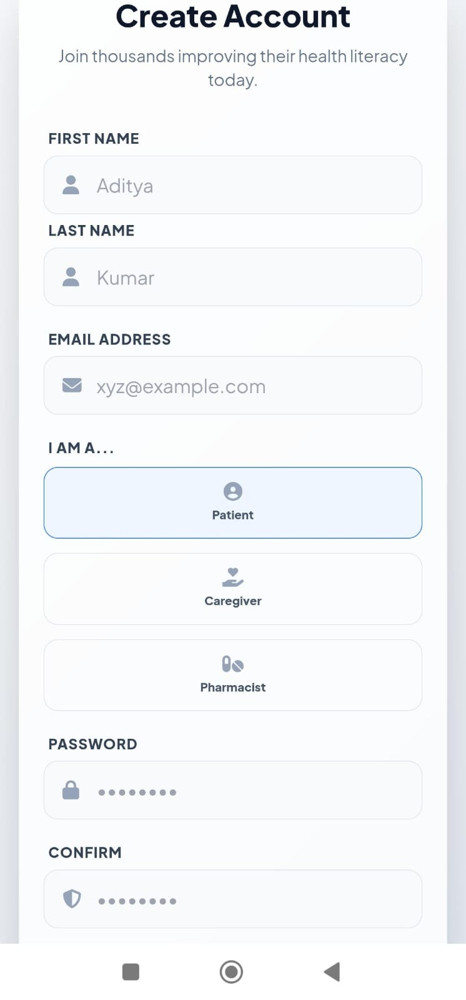</td>
  </tr>
  <tr>
    <td>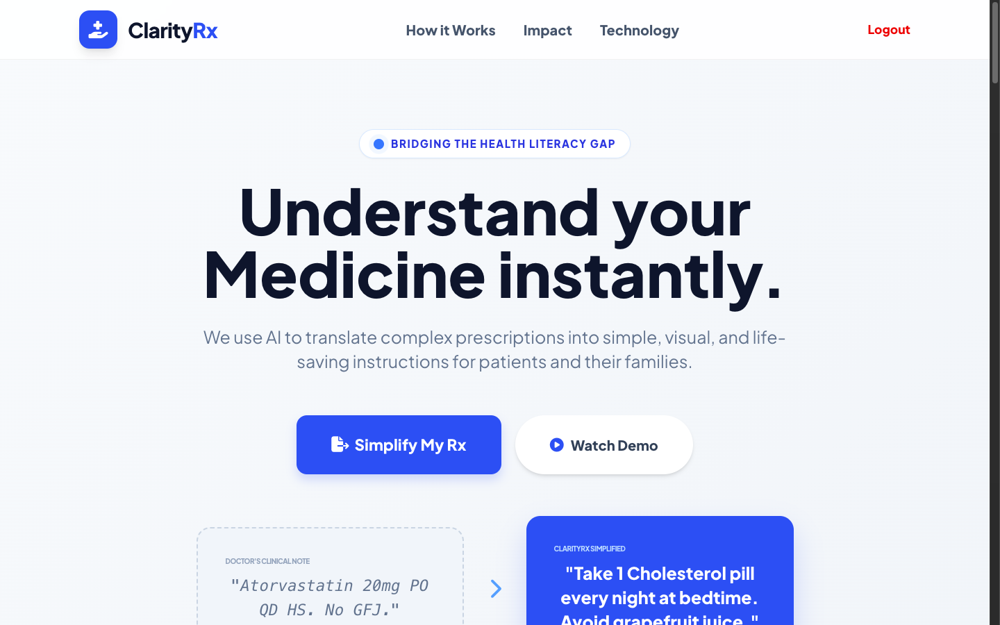</td>
    <td>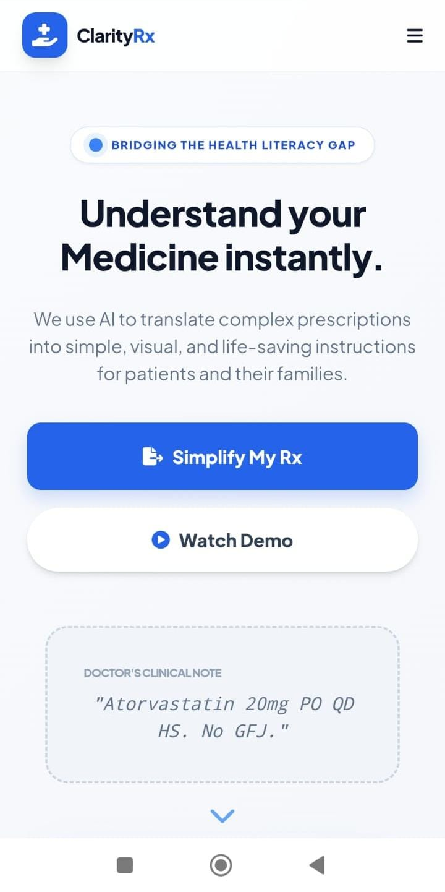</td>
  </tr>
  <tr>
    <td>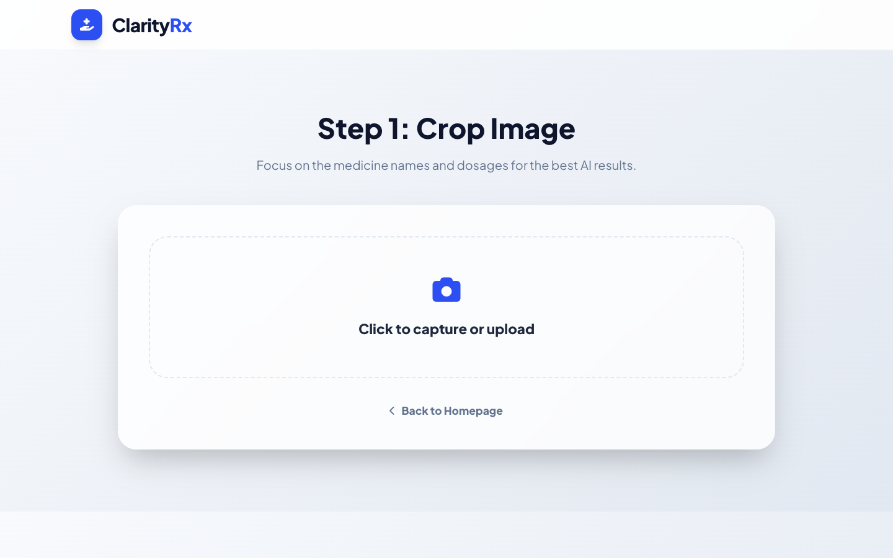</td>
    <td>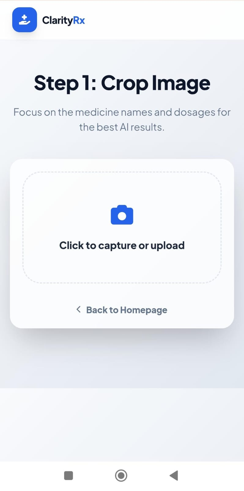</td>
  </tr>
  <tr>
    <td>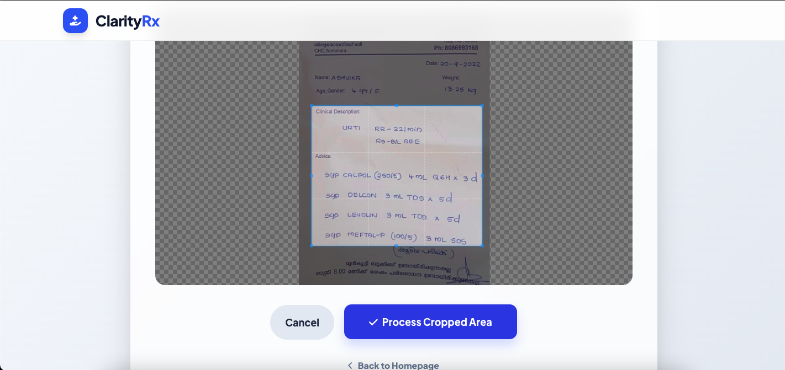</td>
    <td>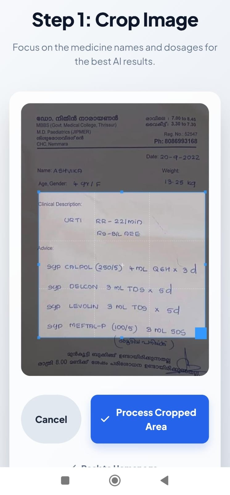</td>
  </tr>
  <tr>
    <td>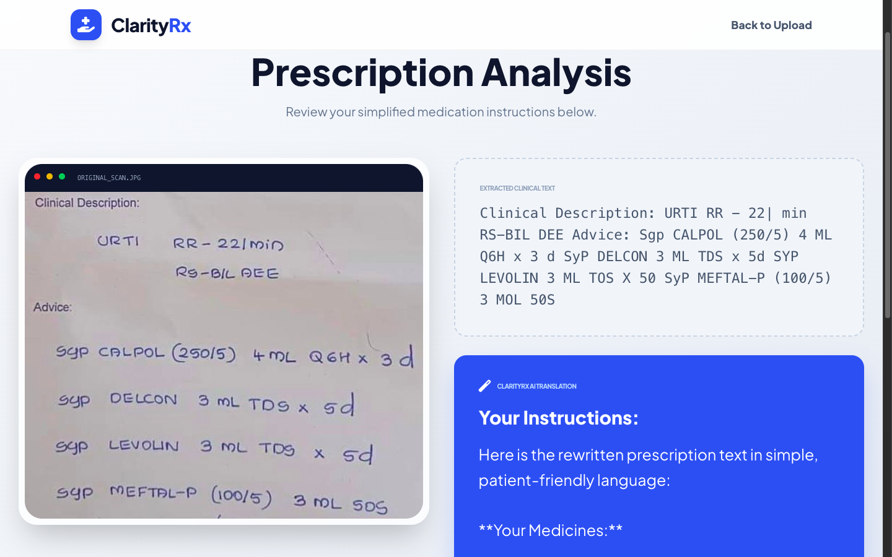</td>
    <td>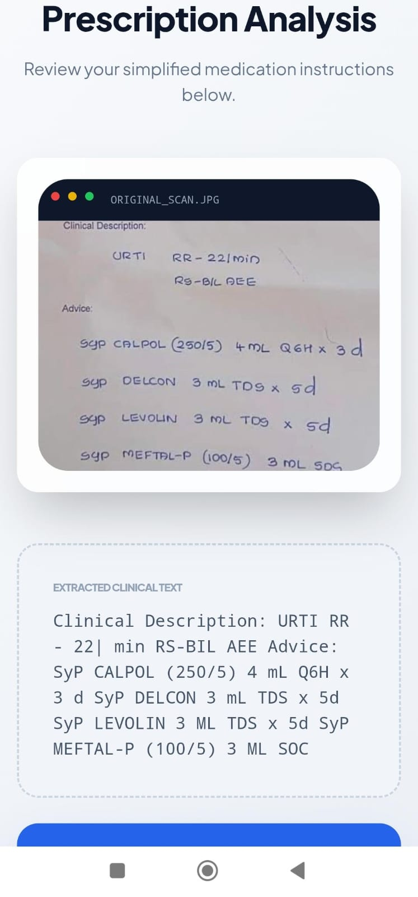</td>
  </tr>
</table>

---
## 👤 Author

Noob-Developer-Real  
B.Tech CSE Student | Django | Backend Development

### Final Note (Mentor Mode 🧠)
<table>
  <tr>
    <td>
Calling it a **college project** does **not** reduce its value.  
What matters is that it shows **real concepts**—API integration, deployment, and system limits.

This README now tells the truth *and* shows competence. That’s exactly where you want to be at this stage.
    </td>
  </tr>
</table>
